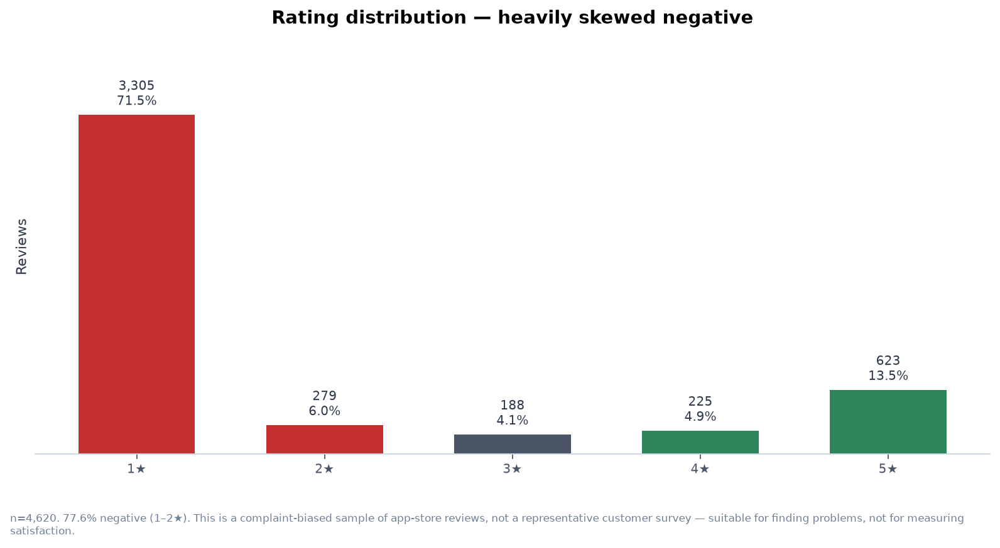
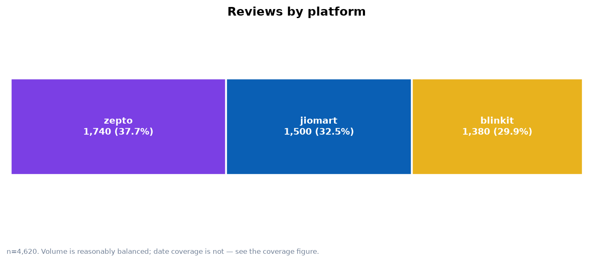
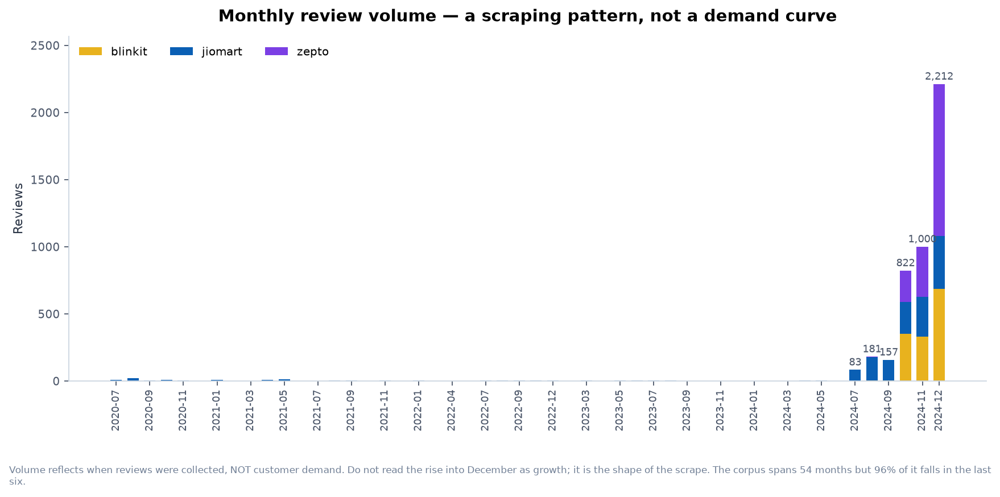
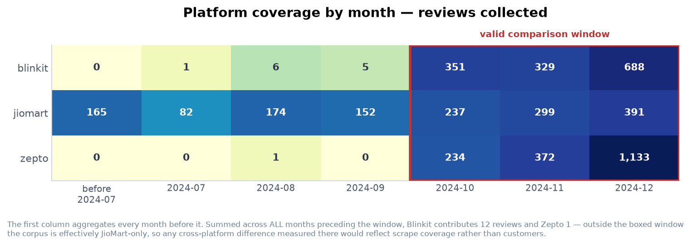
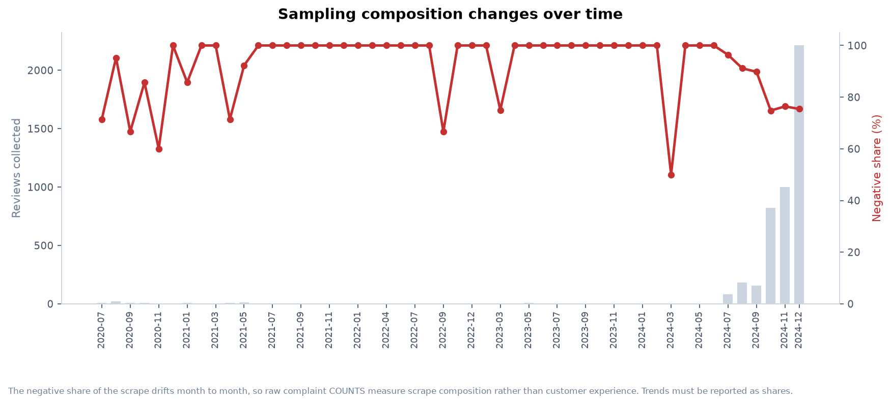
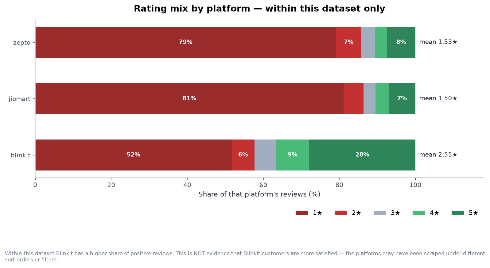
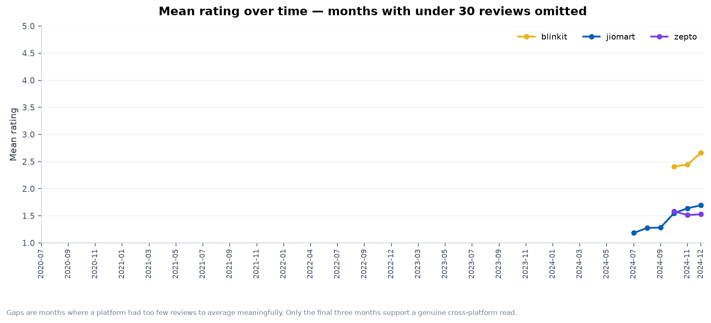
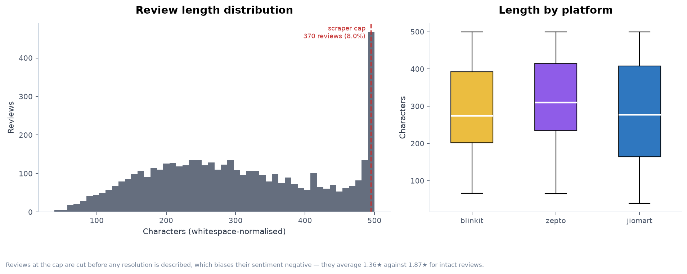
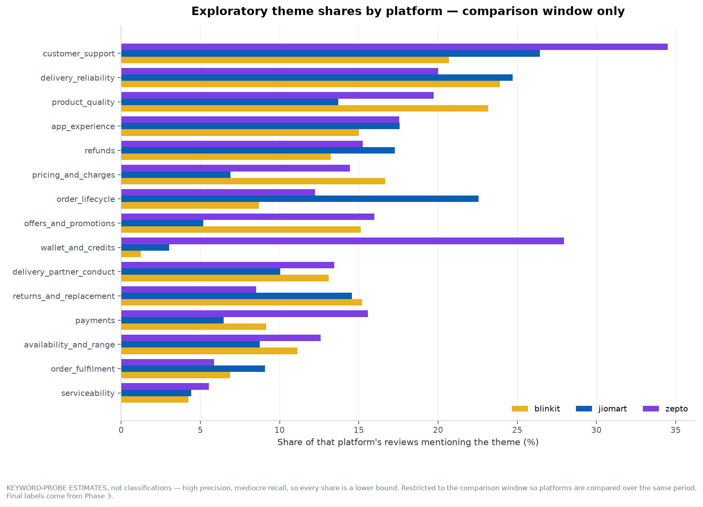

# Exploratory Data Analysis

> Generated by `scripts/03_run_eda.py` from `data/interim/reviews_clean.parquet`. Fully reproducible, no LLM involved. Re-run after any pipeline change.

> **The distinction this whole report rests on.** Review volume in this dataset reflects **when reviews were collected**, not when customers had experiences. Every temporal and comparative figure below reports normalised shares, and raw volume is never treated as a demand signal.

## 1. Dataset profile

| Metric | Value |
| --- | --- |
| Total reviews | **4,620** |
| Platforms | zepto (1,740), jiomart (1,500), blinkit (1,380) |
| Mean rating | 1.83 ★ |
| Date range | 2020-07-21 → 2024-12-31 (1,624 days) |
| Negative (1–2★) | 77.6% |
| Neutral (3★) | 4.1% |
| Positive (4–5★) | 18.4% |
| Truncated at scraper cap | 370 (8.0%) |
| Near-duplicate groups | 18 covering 49 reviews |
| Non-Latin script | 2 |
| Median length | 290 chars / 52 words |

### Rating distribution

| Rating | Reviews | Share |
| --- | --- | --- |
| 1★ | 3,305 | 71.5% |
| 2★ | 279 | 6.0% |
| 3★ | 188 | 4.1% |
| 4★ | 225 | 4.9% |
| 5★ | 623 | 13.5% |

*Rating distribution across the corpus*

*Review volume by platform*

## 2. Temporal analysis

**Volume by month is a sampling pattern.** It rises from double digits to 2,212 in the final month. That is the shape of the scrape, not a demand curve, and it must never be presented as growth.

*Monthly review volume by platform*

### Platform date coverage

| Platform | First review | Last review |
| --- | --- | --- |
| blinkit | 2024-07-27 | 2024-12-31 |
| jiomart | 2020-07-21 | 2024-12-31 |
| zepto | 2024-08-14 | 2024-12-31 |

**December 2024 alone is 47.9% of the corpus.** Coverage is not just thin early on — it is unevenly thin *per platform*, which is what makes naive cross-platform comparison unsafe.

*Platform coverage by month, with the valid comparison window boxed*

### Recommended comparison window

> **2024-10-01 → 2024-12-31** — 4,034 reviews (87.3% of the corpus)

Months where all 3 platforms each have at least 50 reviews: 2024-10, 2024-11, 2024-12. This yields 4,034 reviews (87.3% of the corpus). Outside this window the corpus is effectively single-platform, so any cross-platform difference would measure scrape coverage rather than customer experience.

Selection rule: a month qualifies only when *every* platform has at least **50** reviews in it. Below that, one templated complaint can move a share by several points.

### Sampling composition drifts over time

| Month | Reviews | % negative |
| --- | --- | --- |
| 2020-07 | 7 | 71.4% |
| 2020-08 | 21 | 95.2% |
| 2020-09 | 6 | 66.7% |
| 2020-10 | 7 | 85.7% |
| 2020-11 | 5 | 60.0% |
| 2020-12 | 2 | 100.0% |
| 2021-01 | 7 | 85.7% |
| 2021-02 | 1 | 100.0% |
| 2021-03 | 2 | 100.0% |
| 2021-04 | 7 | 71.4% |
| 2021-05 | 13 | 92.3% |
| 2021-06 | 1 | 100.0% |
| 2021-07 | 1 | 100.0% |
| 2021-08 | 3 | 100.0% |
| 2021-09 | 3 | 100.0% |
| 2021-10 | 2 | 100.0% |
| 2021-11 | 4 | 100.0% |
| 2021-12 | 2 | 100.0% |
| 2022-01 | 3 | 100.0% |
| 2022-03 | 1 | 100.0% |
| 2022-04 | 2 | 100.0% |
| 2022-06 | 1 | 100.0% |
| 2022-07 | 3 | 100.0% |
| 2022-08 | 4 | 100.0% |
| 2022-09 | 3 | 66.7% |
| 2022-10 | 3 | 100.0% |
| 2022-12 | 3 | 100.0% |
| 2023-02 | 2 | 100.0% |
| 2023-03 | 4 | 75.0% |
| 2023-04 | 2 | 100.0% |
| 2023-05 | 6 | 100.0% |
| 2023-06 | 4 | 100.0% |
| 2023-07 | 4 | 100.0% |
| 2023-08 | 4 | 100.0% |
| 2023-09 | 2 | 100.0% |
| 2023-10 | 2 | 100.0% |
| 2023-11 | 1 | 100.0% |
| 2023-12 | 2 | 100.0% |
| 2024-01 | 2 | 100.0% |
| 2024-02 | 2 | 100.0% |
| 2024-03 | 2 | 50.0% |
| 2024-04 | 4 | 100.0% |
| 2024-05 | 4 | 100.0% |
| 2024-06 | 1 | 100.0% |
| 2024-07 | 83 | 96.4% |
| 2024-08 | 181 | 91.2% |
| 2024-09 | 157 | 89.8% |
| 2024-10 | 822 | 74.8% |
| 2024-11 | 1,000 | 76.4% |
| 2024-12 | 2,212 | 75.5% |

The negative share of what was collected moves substantially month to month. **Complaint counts per month are therefore uninterpretable** — a rise could be more scraping, a more negative scrape, or genuinely worse service, and the data cannot distinguish them. Phase 5 trend analysis must use share-of-month, never counts.

*Collection volume against negative share by month*

## 3. Rating analysis

| Platform | Reviews | Mean | % negative | % neutral | % positive |
| --- | --- | --- | --- | --- | --- |
| blinkit | 1,380 | 2.55 | 57.7% | 5.7% | 36.7% |
| jiomart | 1,500 | 1.50 | 86.3% | 3.1% | 10.5% |
| zepto | 1,740 | 1.53 | 85.8% | 3.6% | 10.6% |

*Rating mix by platform*

### Is the rating gap a sampling artefact?

Restricting to the comparison window equalises date coverage. If a platform's rating advantage were purely an artefact of *when* it was scraped, it would move here.

| Platform | Mean (full) | n (full) | Mean (window) | n (window) | Shift |
| --- | --- | --- | --- | --- | --- |
| blinkit | 2.55 | 1,380 | 2.55 | 1,368 | -0.01 |
| jiomart | 1.50 | 1,500 | 1.64 | 927 | +0.14 |
| zepto | 1.53 | 1,740 | 1.53 | 1,739 | -0.00 |

**The platform ranking CHANGES when date coverage is equalised.** Restricting to the comparison window moves jiomart, zepto relative to each other, with the largest single shift being +0.14 stars. This is direct evidence that full-corpus rating comparisons on this dataset are contaminated by *when* each platform was scraped, not only by how customers rated it. Any cross-platform rating statement must therefore be restricted to the comparison window. Even then it describes THIS SAMPLE of reviews, not customer satisfaction: the corpus is complaint-biased and self-selected, and platforms may have been scraped under different sort orders or filters.

*Mean rating over time by platform*

## 4. Review text analysis

| Platform | Median chars | Mean chars | Median words | % truncated |
| --- | --- | --- | --- | --- |
| blinkit | 274 | 296 | 50 | 6.9% |
| jiomart | 277 | 286 | 49 | 8.4% |
| zepto | 310 | 323 | 56 | 8.6% |

*Review length distribution and per-platform spread*

### Truncation bias

| Group | Reviews | Mean rating | % negative |
| --- | --- | --- | --- |
| Truncated | 370 | 1.36 | 90.8% |
| Intact | 4,250 | 1.87 | 76.4% |

Truncated reviews are materially more negative. The plausible mechanism is that they are **cut before any resolution is described** — a review that ends "...but support sorted it out" loses its ending. Severity and resolution labels must be treated as lower-confidence on these rows.

### Most-mentioned terms (document frequency)

Share of reviews containing the term, so one long rant cannot dominate.

**In negative reviews (1–2★)**

| Term | Reviews |
| --- | --- |
| order | 1,701 |
| customer | 1,262 |
| delivery | 1,225 |
| service | 911 |
| worst | 885 |
| time | 874 |
| experience | 824 |
| don't | 754 |
| even | 747 |
| zepto | 743 |
| ordered | 660 |
| support | 632 |
| product | 627 |
| items | 625 |
| refund | 603 |

**In positive reviews (4–5★)**

| Term | Reviews |
| --- | --- |
| delivery | 456 |
| good | 271 |
| time | 208 |
| blinkit | 201 |
| service | 192 |
| order | 175 |
| products | 170 |
| fast | 158 |
| items | 155 |
| it's | 143 |
| experience | 132 |
| like | 118 |
| zepto | 112 |
| minutes | 111 |
| product | 109 |

> Keyword frequency is **exploratory only**. It cannot separate "delivery was fast" from "delivery was late", which is precisely why classification is an LLM job in Phase 3.

### Templated / boilerplate reviews

| Group | Reviews | Platforms | Mean ★ | Sample |
| --- | --- | --- | --- | --- |
| 8 | 10 | zepto | 1.0 | `Worst app I had a very disappointing experience with this app. I have 75 in my wallet, and I just wanted to us…` |
| 11 | 4 | zepto | 1.0 | `1/11/24 I've been using the Zepto app for a while, and overall, I like the convenience it offers. However, I'v…` |
| 12 | 4 | zepto | 1.0 | `I had a very disappointing experience with this app. I have ₹100 in my wallet, and I just wanted to use it, bu…` |
| 9 | 3 | zepto | 1.0 | `I am extremely disappointed with the Zepto app. The wallet feature is completely unreliable - I have money in …` |
| 1 | 2 | blinkit | 1.0 | `Delete this app ASAP if u don't want to waste your money Accidentally I clicked on check out and the order got…` |
| 0 | 2 | blinkit | 1.0 | `They have given coupon of Rs. 50 on first order. But it was not applied on billing. The payment from my wallet…` |
| 5 | 2 | blinkit, zepto | 1.0 | `Almost , always fully priced at MRP, no discounts, no offers, and mostly old, stale stock, hardly fresh & near…` |
| 4 | 2 | blinkit, zepto | 1.0 | `Despite providing feedback on their bread packaging at least 7-8 times, the issue persists. The packaging is c…` |

49 reviews across 18 groups are near-identical. The largest group differs only in a rupee amount. These are flagged, not deleted — deleting them would change the denominator of every percentage in this report — and pain-point counts downstream are reported both raw and representative-only.

## 5. Product-area exploration

> **Estimates, not classifications.** Shares come from keyword probes in `config/taxonomy.yaml` — high precision, mediocre recall, so **every number is a lower bound**. Nothing downstream treats these as labels. Full derivation and the taxonomy rationale: [`docs/TAXONOMY.md`](../docs/TAXONOMY.md).

| Product area | blinkit | jiomart | zepto | All | Spread |
| --- | --- | --- | --- | --- | --- |
| `customer_support` | 20.7% | 26.4% | 34.5% | **28.0%** | 1.7× |
| `delivery_reliability` | 23.9% | 24.7% | 20.0% | **22.4%** | 1.2× |
| `product_quality` | 23.2% | 13.7% | 19.7% | **19.5%** | 1.7× |
| `app_experience` | 15.0% | 17.6% | 17.5% | **16.7%** | 1.2× |
| `refunds` | 13.2% | 17.3% | 15.2% | **15.0%** | 1.3× |
| `pricing_and_charges` | 16.7% | 6.9% | 14.4% | **13.5%** | 2.4× |
| `order_lifecycle` | 8.7% | 22.5% | 12.2% | **13.4%** | 2.6× |
| `offers_and_promotions` | 15.1% | 5.2% | 16.0% | **13.2%** | 3.1× |
| `wallet_and_credits` | 1.2% | 3.0% | 27.9% | **13.2%** | 22.5× |
| `delivery_partner_conduct` | 13.1% | 10.0% | 13.5% | **12.5%** | 1.3× |
| `returns_and_replacement` | 15.2% | 14.6% | 8.5% | **12.2%** | 1.8× |
| `payments` | 9.1% | 6.5% | 15.6% | **11.3%** | 2.4× |
| `availability_and_range` | 11.1% | 8.7% | 12.6% | **11.2%** | 1.4× |
| `order_fulfilment` | 6.9% | 9.1% | 5.9% | **6.9%** | 1.5× |
| `serviceability` | 4.2% | 4.4% | 5.5% | **4.8%** | 1.3× |

*Exploratory theme shares by platform, comparison window only*

### Shared vs platform-specific themes

**Common to all platforms** (spread < 1.5×): `delivery_reliability`, `serviceability`, `availability_and_range`, `refunds`, `delivery_partner_conduct`, `app_experience`

**Elevated on blinkit** (spread ≥ 2×): `pricing_and_charges`

**Elevated on jiomart** (spread ≥ 2×): `order_lifecycle`

**Elevated on zepto** (spread ≥ 2×): `offers_and_promotions`, `payments`, `wallet_and_credits`

### Does equalising the date window change the picture?

Largest movement in any area/platform share when restricted to the comparison window: **4.3 percentage points**. The platform signatures are therefore not an artefact of differing date coverage.

## 6. Validation

| Check | Result |
| --- | --- |
| Row count matches Phase 1 | PASS (4,620 / 4,620) |
| Platform counts reconcile | PASS |
| Rating counts reconcile | PASS |
| No nulls introduced | PASS (0 null cells) |
| Review IDs unique | PASS |
| Dates valid and unchanged | PASS |
| Ratings within 1–5 | PASS |
| Truncation count reconciles | PASS |

**Overall: ALL CHECKS PASSED**

---

Product Intelligence Summary and Phase 3 recommendations: [`docs/EDA_FINDINGS.md`](../docs/EDA_FINDINGS.md).

